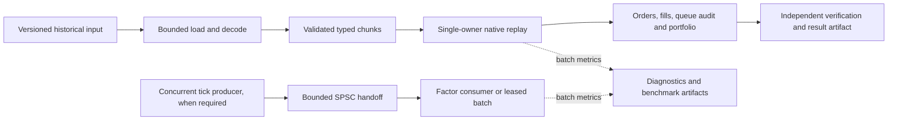

# Gambit latency infrastructure improvement plan

Date: 2026-09-20. Status: LAT-01 complete; LAT-02 runner implemented and locally verified; LAT-03 diagnosis complete; LAT-04 full-volume synthetic parity complete; LAT-05 measured FIFO optimization complete and retained as experimental. LAT-06 comparison complete; original ring retained after rejecting the measured throughput/age tradeoff. LAT-07 input preparation is complete for engineering acceptance: the fused synthetic generator is retained as an explicit experimental mode; original storage loading remains the default. LAT-08 batch diagnostics and bounded shutdown reporting are complete for engineering acceptance; detailed probes remain opt-in. LAT-09 review is complete with an explicit remain-experimental decision; its performance/production gate did not pass. LAT-10 remains optional and not started. See the [LAT-09 disposition](documentation/performance/qualification_decision_2026-09-20.md). See the [LAT-08 evidence](documentation/performance/batch_diagnostics_2026-09-20.md). See the [LAT-07 evidence](documentation/performance/input_preparation_2026-09-20.md). See the [LAT-06 decision](documentation/performance/handoff_optimization_2026-09-20.md). See the [LAT-05 optimization evidence](documentation/performance/fifo_optimization_2026-09-20.md), [LAT-04 trace evidence](documentation/performance/fifo_parity_2026-09-20.md), [LAT-03 profiles](documentation/performance/fifo_profile_2026-09-20.md), [LAT-02 evidence](documentation/performance/controlled_replay_2026-09-20.md) and [runner runbook](documentation/operations/controlled_replay.md).

The user delegated definition and approval of the contract on 2026-09-20. [LATENCY_BUDGET.md](LATENCY_BUDGET.md), contract `gambit-fifo-latency-v1`, now governs the concrete workload, reference host, measurement boundaries, capacities and engineering thresholds. Production qualification remains pending; proposal language below records planning context and is superseded by that contract where applicable.

## Recommendation

Prioritize a reproducible measurement contract, profile the existing direct FIFO replay, and optimize its measured bottlenecks. Evaluate queue improvements separately against Gambit's existing batched and zero-copy paths. Adopt external dependencies only when they improve a representative end-to-end workload enough to justify their portability, maintenance, and operational costs.

The first delivery should be a controlled baseline and an attributable profile, followed by one small optimization with complete correctness evidence. A new framework, logger, IPC layer, or codec is not a prerequisite. The survey is useful as a catalog of techniques and comparison implementations; its repository rankings and nanosecond benchmarks are not Gambit acceptance criteria.

## Sources and authority

The requested HFT document is `~/Dropbox/hft-latency-infrastructure.md`, titled **Latency Infrastructure Repos (C++, 100+ stars)**, compiled 2026-09-20. All 19 main repository entries were reviewed through their public upstream pages/READMEs; selected queue source was also inspected. The supplemental timing, encoding, networking, and clock references are addressed below. This is a suitability survey, not a dependency security audit or a reproduction of upstream benchmarks.

“Production project plan” is interpreted as both the GitHub-backed production template and Gambit's existing production-readiness plan:

| Source | Revision reviewed | Use in this plan |
|---|---|---|
| [Gambit](https://github.com/joshuamyers22/gambit) local checkout | `9c550bdae592e975f12046ebbb8d690889fd9206` | Actual implementation, tests, benchmark artifacts, product boundary |
| [Production project template](https://github.com/joshuamyers22/production-project-template) local checkout | `6526db479fced81463d1a97e25ff3ceefbe9eee2` | Outcome-first planning, bounded resources, performance experiments, release evidence and rollback |
| [Production-readiness plan](PRODUCTION_READINESS_PLAN.md#p12--native-replay-capability-and-performance) | Same Gambit checkout | Expand P1.2 and Milestone 5; do not replace existing production gates |
| [Approved engineering latency contract](LATENCY_BUDGET.md) | Updated 2026-09-20 under user delegation | Synthetic v1 workload, host, timer boundaries, capacities and acceptance criteria; achieved qualification remains open |

The template guidance used is `docs/PRODUCTION_BLUEPRINT.md`, `docs/LATENCY_SENSITIVE_CPP_GUIDE.md`, `templates/IMPROVEMENT_PLAN.md`, and `templates/PERFORMANCE_EXPERIMENT.md`. Public upstream material was consulted on 2026-09-20; URLs can change and must be pinned to a commit before an implementation experiment.

**Access limitation:** authenticated GitHub access returned HTTP 401, and the browser could not retrieve the two owner repositories. Their latest remote state was not verified. This plan uses the explicit local revisions above, not an assumed current GitHub HEAD. No GitHub issues, project board, or pull request has been created.

## Outcome, scope and invariants

Improve time to a valid, reproducible historical research result, and improve bounded tick handoff where a concurrent producer/consumer is actually required. Preserve the in-process Python library, the existing C++11/setuptools build unless a separate decision justifies migration, and supported Linux/macOS paths including ARM64.

Gambit's [project brief](PROJECT_BRIEF.md) excludes live order routing and brokerage connectivity. Native historical replay remains experimental and supports a fixed compiled strategy with restricted execution models. Performance improvements do not establish general Python `Strategy` parity or production qualification. The general strategy release does not depend on promoting native replay.

Non-negotiable invariants:

- Preserve exact event order, receive-time causality, integer arithmetic and overflow behavior, fees, shared cash, order eligibility, queue assumptions, risk behavior and immutable output semantics.
- No skipped validation, dropped replay events, approximate accounting, missing audit records, or publishable results after run failure.
- Keep a single mutable owner for each portfolio. Instrument-level parallelism cannot change shared-cash fill priority.
- Bound chunks, queues, audits, memory, waits and shutdown. Capacity exhaustion is an explicit outcome, never silent success.
- Preserve input ownership and lifetime while native code releases the GIL; a borrowed buffer or read-only view alone does not prove that aliases cannot mutate it.
- Treat diagnostic telemetry separately from the authoritative order/fill/queue audit. Only explicitly optional diagnostics may be sampled or dropped, with visible counters.

## Baseline and gaps

These are historical measurements and source observations, not newly executed benchmarks.

| Area | Existing evidence | Consequence for planning |
|---|---|---|
| FIFO replay | 946,944,000 synthetic 88-byte events; 9.084, 9.105 and 9.150 seconds execution; approximately 59 seconds full harness; peak RSS approximately 262 MB | Proposed five-second execution target is missed. Three runs cannot qualify tail percentiles. |
| Timer scope | Initialization + native batch calls + final result materialization; generation, input hashing, independent checks and much caller overhead excluded | Report user-visible wall time separately; fast execution is not fast cold loading. |
| Input size | Approximately 83.3 GB logical input, generated incrementally on a 24 GiB Apple M4 | Chunk-resident execution is not evidence for an entirely RAM-resident or storage-loaded corpus. |
| Correctness | Full synthetic fill ledger reconciliation and deterministic hashes; independent Python trace parity on smaller corpora | Full-volume independent trace/accounting parity remains a promotion gate. |
| Market-only replay | One final three-year run approximately 1.312 seconds | Different semantics/workload; cannot substitute for FIFO evidence. |
| Tick handoff | Existing bounded SPSC, copied batches, leased NumPy views, in-place C++ consumer, spin/backoff/park policies | Compare with existing alternatives before introducing another queue. |
| Zero-copy characterization | At batch 1,024: copied ring 17.01M/s, zero-copy 33.57M/s, C++ in-place 37.51M/s, ordinary Python/NumPy batch 70.42M/s | Zero-copy was useful in one comparison but was not universally fastest; small batches showed overhead. |
| Build and CI | C++11 native extensions; warning and sanitizer infrastructure; manual, non-blocking shared-runner performance smoke job | Add controlled performance evidence without imposing unstable timing gates on shared CI. |

Evidence: [FIFO report](documentation/performance/fifo_backtest_2026-09-04.md), [zero-copy report](documentation/performance/tick_ring_zero_copy_2026-08-29.md), [replay ADR](documentation/architecture/adr_native_tick_replay.md), [performance workflow](.github/workflows/performance.yml), and [build contract](setup.py).

The median-to-target gap implies approximately **45% less execution time**, or **1.82× throughput**, for the old synthetic workload. That is arithmetic, not a speedup forecast or a p95 comparison. If the other approximately 50 seconds of harness work were unchanged, reducing execution from 9.1 to five seconds would improve full harness time by only about 7%. Real loading and preprocessing therefore deserve their own workstream and budget.

### Source-level optimization hypotheses

| Location | Observed implementation | Experiment justified by a profile |
|---|---|---|
| [Native replay](src/gambit/cpp/factor_cache/top_of_book_backtest.cpp) | Direct contiguous batch scan, GIL release, per-event validation, instrument-indexed state, bounded pre-reserved audit vectors, final NumPy copies | Attribute validation, dispatch, FIFO state, accounting and copies before changing layout or branches; preserve every rejection rule. |
| [SPSC ring](src/gambit/cpp/factor_cache/spsc_ring.hpp) | Opposite cursor acquired on every push/pop; separate `alignas(64)` cursors; per-record producer publication; consumer spans already exist | Compare cached opposite cursors, bounded producer spans, fewer publication operations, and target-appropriate alignment. These are hypotheses, not diagnosed bottlenecks. |
| [Tick-ring wrapper](src/gambit/cpp/factor_cache/tick_ring.cpp) | Atomic pushed/popped counters, spin counters, batch wakeup mutex/condition variable, close state and lease management | Measure wrapper, counters and wakeups separately from the ring. Batch accounting only if snapshot semantics remain explicit; preserve lost-wakeup protection. |
| [Factor processor](src/gambit/cpp/factor_cache/tick_ring.cpp) | Per-event instrument lookup in an unordered map | Evaluate a validated compact-ID table only for a bounded instrument universe; retain arbitrary-ID behavior where required. |
| [Replay benchmark](benchmarks/top_of_book_backtest.py) | Synthetic generation and hashing between timed batches; fixed audit capacity; no repeated-run distribution driver | Add immutable input manifests, storage-backed runs, repeated trials and resource accounting before drawing architecture conclusions. |

The replay scan does not use the SPSC ring. A queue improvement must demonstrate value in the concurrent factor/transport path and cannot be counted as a FIFO replay improvement.

## Repository survey and disposition

“Compare” means a benchmark/reference candidate, not approval to vendor it. “Conditional” means an identified requirement and measured benefit must precede adoption. All external code requires an exact revision, license/notice review, supported-platform build, dependency inventory, and an owner before integration. No star-count or upstream speed ranking is an acceptance gate.

| Repository and upstream source | Relevant idea | Gambit disposition and trigger |
|---|---|---|
| [scylladb/seastar](https://github.com/scylladb/seastar) | Shard ownership and asynchronous execution | **Architecture reference only.** Framework/runtime migration is disproportionate to an in-process replay library. Reconsider for a separately approved Linux service. Current README supports C++23/C++26, beyond the survey's C++20 description. |
| [rigtorp/SPSCQueue](https://github.com/rigtorp/SPSCQueue) | Cached opposite cursors, padding, bounded SPSC; C++11 | **First external comparison.** Compare the current ring, a small local improvement, and upstream under identical payloads and wrapper semantics. Its arbitrary capacities and `front()`/`pop()` API differ from the survey description. |
| [rigtorp/Seqlock](https://github.com/rigtorp/Seqlock) | Single-writer snapshot publication | **Do not adopt as supplied.** README describes x86-specific compiler-fence assumptions; Gambit supports ARM64. A future snapshot need requires a standards-conforming design with lifetime/reclamation proof and bounded reader behavior. |
| [odygrd/quill](https://github.com/odygrd/quill) | Deferred formatting, configurable queue behavior, C++17 | **Conditional first logger trial.** Only if required diagnostics create measured cost. Compare with existing counters and batch summaries; account for queue policy, argument handling, sink stalls and C++17 migration. |
| [PlatformLab/NanoLog](https://github.com/PlatformLab/NanoLog) | Compact binary logging and offline formatting | **Defer.** Reconsider only for a demonstrated high-volume diagnostics requirement that tolerates decoder/build coupling. Both preprocessor and ordinary C++17 variants exist. |
| [MengRao/SPSC_Queue](https://github.com/MengRao/SPSC_Queue) | In-place allocation/publication, shared-memory use | **Design reference; conditional IPC trial.** First establish a process-isolation requirement. Audit interprocess synchronization, ownership, initialization, stale segments and peer death; an in-process SPSC does not supply these guarantees. |
| [max0x7ba/atomic_queue](https://github.com/max0x7ba/atomic_queue) | Bounded SPSC/MPMC and comparative benchmarks | **Secondary comparison.** Use if genuine multi-producer topology is needed. Establish domain event ordering separately; an MPMC queue does not determine exchange/global sequence. Check the selected version's language/CPU assumptions. |
| [MengRao/fmtlog](https://github.com/MengRao/fmtlog) | Compact deferred logging | **Conditional comparator to Quill**, in the same experiment, if logging is justified. Include polling, flush, overflow and supported-toolchain behavior in the decision. |
| [khizmax/libcds](https://github.com/khizmax/libcds) | Concurrent structures and explicit safe reclamation | **Defer.** Consider for demonstrated shared control-plane state, not fixed portfolio arrays. Reclamation and ABI/build requirements add complexity. |
| [mpoeter/xenium](https://github.com/mpoeter/xenium) | Policy-based algorithms and reclamation comparisons | **Research reference.** Reconsider with a concrete dynamic shared-state requirement; current single-owner replay does not need a reclamation subsystem. |
| [DNedic/lockfree](https://github.com/DNedic/lockfree) | Static bounded structures and contiguous bipartite buffers | **Optional queue comparison.** Useful if wraparound or contiguous ingestion is measured as a cost; preserve current NumPy lease lifetime and close behavior. |
| [chronoxor/FastBinaryEncoding](https://github.com/chronoxor/FastBinaryEncoding) | Generated internal message schemas and language interoperability | **Conditional boundary codec.** Benchmark against current typed arrays only for a new persisted/IPC protocol. Do not serialize already typed in-process arrays merely to use a codec. |
| [chronoxor/CppServer](https://github.com/chronoxor/CppServer) | Asio-based networking | **Defer outside current product scope.** Evaluate in a separate acquisition/service adapter when network ingestion is authorized and specified. |
| [riyaneel/Tachyon](https://github.com/riyaneel/Tachyon) | Same-machine shared-memory IPC and language bindings | **Conditional isolated prototype.** Needs process isolation as a product requirement, ABI/lifetime/failure tests, and measured Python end-to-end benefit. C++23/Clang requirements are a substantial build change. |
| [ucbrise/confluo](https://github.com/ucbrise/confluo) | Append-oriented monitoring, filters and aggregates | **Design reference only.** Batch summaries and existing artifacts are the smaller current solution; reconsider if a separately operated query service is justified. |
| [AlexeyAB/object_threadsafe](https://github.com/AlexeyAB/object_threadsafe) | Read-heavy synchronization comparison | **Defer.** No identified need to wrap replay state in shared mutable objects. Use explicit ownership and immutable configuration first. |
| [jnk0le/Ring-Buffer](https://github.com/jnk0le/Ring-Buffer) | Compile-time bounded C++11 SPSC storage | **Optional reference.** Useful only if static allocation is required; Gambit currently exposes runtime queue capacities. |
| [microsoft/L4](https://github.com/microsoft/L4) | Read-oriented hash table and epoch reclamation | **Do not add as a dependency.** Repository archive on 2026-06-11 is confirmed. Read for ideas if a future reference-data cache requires them. |
| [craflin/LockFreeQueue](https://github.com/craflin/LockFreeQueue) | Small MPMC implementation | **Reading/comparison only.** No present MPMC requirement; any reconsideration requires a memory-model and saturation review. |

### Corrections and qualifications to carry forward

- Rigtorp's upstream queue permits arbitrary non-power-of-two capacities and uses an extra slot. It exposes `front()` and `pop()`, not the survey's claimed `try_pop()` pair. Gambit's own power-of-two ring contract is separate. [Upstream usage and implementation](https://github.com/rigtorp/SPSCQueue#usage).
- Do not infer portable race freedom from a seqlock retry or a compiler barrier. Sequence checks do not by themselves legalize concurrent non-atomic payload accesses. Gambit's production guide explicitly requires a C++-conforming memory model; the supplied x86-oriented implementation is unsuitable as an ARM64 default. [Upstream implementation discussion](https://github.com/rigtorp/Seqlock#implementation).
- Seastar's current README specifies C++23/C++26 and optional DPDK. Treat “no locks/atomics in steady state” and “all-or-nothing” as broad architectural characterizations, not a verified property of every operation or integration. [Current build guidance](https://github.com/scylladb/seastar#building-seastar).
- Quill's bounded/unbounded and blocking/dropping choices mean deferred formatting alone does not prove bounded memory, zero allocation or bounded caller latency for all types and conditions. Its published observations also average multiple log calls; they are not Gambit's event-latency distribution. [Upstream README](https://github.com/odygrd/quill).
- NanoLog does not always require the custom preprocessor: its C++17 variant is built and linked as a library. Binary-log decoding and operational usability still need evaluation. [Upstream variants](https://github.com/PlatformLab/NanoLog#building).
- Very small benchmark numbers describe favorable measurements, not guaranteed best- or worst-case bounds. Do not carry those numbers into the project budget.

### Supplemental references and deferred infrastructure

| Reference | Decision |
|---|---|
| [MengRao/tscns](https://github.com/MengRao/tscns) | Optional x86 timing experiment only after probe overhead is shown material. Preserve a monotonic portable clock; check calibration, migration, virtualization and clock behavior. The upstream README itself notes Linux vDSO clock access, so `clock_gettime` is not necessarily a syscall. |
| [SBE](https://github.com/aeron-io/simple-binary-encoding) | The survey's `real-logic` URL redirects here. Evaluate only for an actual protocol/schema requirement; generated codecs do not provide feed recovery or venue semantics. |
| [Onload](https://github.com/Xilinx-CNS/onload), [DPDK](https://www.dpdk.org/) and ef_vi | Defer until a separate live acquisition/network-latency project exists. Historical prepared-array scans have no NIC receive stage to accelerate. Hardware compatibility, privileges, CPU use and operating cost would need their own plan. |
| [Linux PTP](https://www.linuxptp.org/) | Relevant to future capture timestamp quality. Historical replay must preserve source/receive-time definitions; synchronized wall time is not its execution duration clock. |

## Proposed architecture

Measure the full historical path and its constituent stages. Keep the concurrent handoff path independently benchmarked. Optional adapters own IPC, codecs and platform-specific tuning; they must not change execution policy. Parallelize independent portfolios or experiments first if throughput warrants it, with process count and aggregate memory bounded. Do not parallelize a shared portfolio by instrument without preserving its total event order and cash semantics.

## Prioritized implementation backlog

Roles are proposed responsibilities, not named staffing commitments. Josh Myers is the existing replay decision authority; engineering owners must be named at kickoff. Estimates are focused engineering days for an experienced native/Python engineer plus reviewer time, excluding procurement, corpus licensing and large parity-run compute. Dates are relative to an approved kickoff. LAT-01 is **complete for synthetic engineering acceptance**. LAT-02 is **implemented and locally verified**; LAT-03 is **complete for diagnosis**; LAT-04 is **complete for synthetic v1 trace parity**; LAT-05 is **complete and retained as experimental**; LAT-06 is **complete as an experiment; original ring retained**; LAT-07 is **complete for engineering acceptance, retained experimental**; LAT-08 is **complete for engineering acceptance, diagnostics opt-in**; LAT-09 is **complete as a review: remain experimental, qualification not achieved**; LAT-10 is **optional and not started**. Full qualification and representative storage measurements remain separate evidence work.

| ID / priority | Smallest deliverable and acceptance evidence | Dependencies | Proposed owner | Effort / target |
|---|---|---|---|---|
| LAT-01 / P0 — complete 2026-09-20 | Approved `gambit-fifo-latency-v1`: canonical eight-instrument FIFO, M4 reference host, five-second p95 prepared-chunk execution, separate harness/resource bounds, dense/adversarial controls, sampling and failure rules. Production qualification remains open. | None | Native lead + domain owner; Josh decides scope | 2–3 days / week 1 |
| LAT-02 / P0 — implemented 2026-09-20 | Added controlled isolated workers, bounded input/storage manifests, repeated sessions, paired screening, raw provenance/timing/resource reports, watchdogs and qualification decisions. Full synthetic and dense trials plus storage/fault smoke tests verified locally; see the runbook and evidence. | LAT-01 definitions; historical controls may start immediately | Performance engineer | 3–5 days / weeks 1–2 |
| LAT-03 / P0 — complete 2026-09-20 | Captured separate FIFO/ring native samples and full-volume Python attribution, plus 30 paired probe trials each for sparse-prefix and dense controls. Ranked three falsifiable hypotheses with retained raw evidence. Sparse execution probe effect +0.42%, 95% interval −0.90% to +1.17%: the 1% target remains inconclusive; no qualification claimed. | LAT-02 | Native/performance engineer | 2–3 days / week 2 |
| LAT-04 / P0 — complete for synthetic v1, 2026-09-20 | Standalone independent policy reference and supervised streaming comparison passed all 946,944,000 primary events at three chunk sizes, plus 2y and 1m/2m dense controls. All audit fields and 3,230 portfolio checkpoints matched; hand-derived/Python cross-checks cover shared cash, lifecycle, malformed input and overflow. No native capability gap found for v1; production-specific capabilities remain separate. | LAT-01; overlaps measurement work | Quant/domain + native engineers | 4–8 days plus oracle runtime / weeks 2–4 |
| LAT-05 / P1 — complete 2026-09-20, retained experimental | Specialized validated FIFO traversal and extracted rebalance processing. Thirty full primary pairs: p50 9.663 → 4.138 s; median paired reduction 57.19%, 95% interval 57.06–57.38%. Four control screens and six renewed full-volume parity cases passed; 2,199 tests and ASan/UBSan passed. An isolated dense maximum-RSS outlier is retained with allocation/replication evidence; qualification remains open. See the [report](documentation/performance/fifo_optimization_2026-09-20.md). | LAT-03 and relevant LAT-04 safety net | Native engineer | 4–8 days / weeks 3–5 |
| LAT-06 / P1 — experiment complete 2026-09-20, baseline retained | Compared the user-selected existing factor pipeline across three local variants and pinned Rigtorp: 180 workers, complete factor parity, copy/lease/direct and scheduled/stall controls. Batch publication improved copy/lease completion 24%/68% but raised saturated diagnostic p99 age from 42 μs to 1.85 ms; user selected the original ring. No optimization or dependency adopted. Runner, stronger concurrency tests and [rejection evidence](documentation/performance/handoff_optimization_2026-09-20.md) retained. | LAT-02/03; existing factor pipeline selected by user | Native engineer | Completed bounded investigation; production qualification open |
| LAT-07 / P1 — complete 2026-09-20, retained experimental | Added a fused, byte-identical synthetic generator and bounded reusable chunks. Thirty full primary pairs: harness p50 57.164 → 33.004 s; median paired reduction 42.32% (95% interval 42.11–42.54%), peak RSS −20.09%. Dense/chunk controls, a short-tail replication and longer follow-up passed review. Buffered/mapped raw-record alternatives did not meet the end-to-end threshold; original storage loader retained. 2,247 tests and 28 ASan/UBSan input tests passed. See the [report](documentation/performance/input_preparation_2026-09-20.md). | LAT-02/03; approved synthetic corpus and bounded manifest-backed raw fixtures | Data/performance engineer | Engineering scope complete; real-data/cold-storage qualification remains open |
| LAT-08 / P1 — complete 2026-09-20, diagnostics opt-in | Added bounded batch histograms, queue high-water/full/admission/age signals, failure accounting, shared cleanup deadlines and process-group shutdown reporting. Fixed traceback-held leases and helper-held protocol pipes. Final 30-pair handoff screen: +13.90% saturated probe overhead (95% interval +9.74–23.14%); probes remain diagnostic. FIFO controls preserve hashes; full-volume 1% probe qualification remains open. 2,283 tests and all `make check` checks passed. See the [report](documentation/performance/batch_diagnostics_2026-09-20.md). | LAT-03; integrates LAT-05/06 without changing the native ring or FIFO | Native + operations owner | Engineering scope complete; no logger dependency or promotion |
| LAT-09 / P0 gate — review complete 2026-09-20, remain experimental | Audited source/binary identity and six preserved full-volume trace cases; 2,283 tests, 208 ASan/UBSan tests, 1.8-million-record TSan probe and clean Clang analysis. Three macOS Python wheels plus sdist each passed 97 native tests. Eight controlled checks matched reviewed controls; primary execution 3.982–4.068 s, explicitly ineligible for qualification. Published [decision/evidence](documentation/performance/qualification_decision_2026-09-20.md) and [rollback/reopening runbook](documentation/operations/replay_qualification.md). | All selected changes and LAT-04 | Engineering review recorded; Josh retains product/repository authority | Disposition complete; committed-candidate/Linux x86-64/session/probe/production/reviewer gates remain open |
| LAT-10 / P2 | Optional IPC, codec or shared-snapshot feasibility record; one narrowly scoped prototype, crash/overload tests, operational cost, adopt/reject decision. | Separate approved requirement and LAT-09 baseline | Platform owner | 3–5 days per selected prototype; outside base estimate |

The base work is approximately **26–45 engineering days**, roughly **6–9 weeks for one engineer with available review**, subject to corpus access and full-volume oracle cost. Reserve additional time explicitly if the representative strategy requires substantial new behavior. Queue work can be deferred if no concurrent workload needs it; a logger, IPC system and framework migration are not included in this estimate.

### Milestone gates

1. **M0 — Contract and baseline (weeks 1–2):** LAT-01/02 complete; chosen corpus and host recorded; no unsupported target claims. If the workload remains synthetic, label the outcome characterization and keep promotion open.
2. **M1 — Diagnosis and semantic safety (weeks 2–4):** LAT-03 complete; LAT-04 synthetic coverage and full-volume trace comparison complete; top cost identified with a profile. Production-specific capability/corpus evidence remains separate. Unsupported execution semantics block performance acceptance.
3. **M2 — Measured improvements (weeks 3–6):** selected LAT-05/06/07 changes pass focused parity and resource checks and improve their declared path. Reject complexity without a material end-to-end benefit.
4. **M3 — Qualification decision (weeks 6–9):** LAT-09 records **remain experimental** with LAT-04/05 trace evidence and fresh local checks. P1.2/Milestone 5 promotion requirements remain open. A completed negative gate review or a few fast runs never changes maturity.

## Measurement and acceptance design

The table below is the original planning proposal. Approved v1 criteria in [LATENCY_BUDGET.md](LATENCY_BUDGET.md) supersede it: synthetic execution p95 ≤5 s, full-harness p95 ≤75 s, process RSS ≤512 MiB, and explicit workload/statistical/lifecycle rules. Handoff and absolute storage targets remain outside v1; none is an achieved guarantee.

| Dimension | Required measurement / proposed decision rule |
|---|---|
| Historical execution | Preserve the existing candidate p95 ≤ 5.000 seconds for the approved 946,944,000-event FIFO-equivalent workload, or explicitly replace it with an owner-approved workload/target. Publish p50/p95/p99/max and sample counts; do not relabel the old median as p95. |
| User-visible completion | Report load/decode, initialization, processing, materialization, hashing, verification, persistence if included, and complete wall time. Set a wall-time target after the storage baseline; do not infer it from the execution target. |
| Candidate retention | Starting rule: ≥10% improvement in the affected end-to-end path with uncertainty excluding no improvement, or a separately justified capacity/tail benefit. Microbenchmark gains alone are insufficient. |
| Regression guardrails | Starting rule: no unexplained >5% increase in relevant p99 or peak RSS on unchanged workloads. Capacity, numerical, ordering or audit regressions block adoption regardless of speed. Investigate measurement noise before attributing a regression. |
| Handoff | Record enqueue-to-consumer latency, queue residence, occupancy, accepted/rejected records, burst recovery and CPU use. Establish p99/max-age targets from the actual producer rate and consumer deadline; upstream nanoseconds supply no target. |
| Capacity and overload | Expected load, 2× proposed peak/burst case, slow/paused consumer, full queue, audit exhaustion, allocation failure and shutdown. Account for every input; no deadlock or silent loss; measured failure/drain bounds set in LAT-01. |
| Correctness | Exact complete integer order/fill/queue and portfolio parity for supported replay; explicit floating-point tolerances only for separately existing factor semantics. Deterministic native hashes and terminal balances alone do not establish independent trace parity. |
| Resources | RSS, allocation count, page faults, copies/bytes, CPU, context switches, queue depth, cache/branch counters where supported, audit occupancy and thread/process count. Report missing/unavailable counters honestly. |

Measurement protocol:

1. Preserve the historical seeds, input/result hashes, sparse workload and prime/power-of-two chunk comparisons as controls. Add representative skew, bursts, dense cancellations, partial fills, equal timestamps and capacity boundaries. Keep experimental comparisons on identical semantics and inputs.
2. Record commit, dirty-state indicator, source/binary/input digests, compiler/flags, dependency identity, OS/kernel, CPU and memory/topology, power/thermal state, affinity and background load. Use optimized symbolized builds; never compare sanitizer timings to release timings.
3. Distinguish storage-cold, normally warm and deliberately prewarmed runs. Do not claim cold caches without evidence. Fresh engine state is required for each trial; warm-up must not reuse a completed portfolio.
4. Start optimization screening with at least 30 independent alternating/randomized baseline/candidate trials. For qualification, propose at least 200 full replay trials across multiple sessions, quantile confidence intervals and a stopping criterion based on precision. That count alone does not establish a reliable p99 or p99.9; increase it or explicitly leave those claims unqualified. For high-volume handoff measurements, use many event samples across independent trials and report within-run correlation separately.
5. Measure end-to-end latency directly; do not add stage percentiles. Compare instrumentation on/off, use batch-level probes by default, and avoid logging or timestamping every event without an overhead experiment. For handoff, use scheduled arrivals independent of consumer progress so stalls are not omitted from the distribution.
6. Run the supported x86-64 and ARM64 correctness/build matrix. Performance targets apply only to the approved reference host; a Linux affinity result is not an Apple Silicon guarantee. Measure relevant co-located processes and CPU contention before recommending pinning, busy-spin or NUMA changes.
7. Complete a performance-experiment record per candidate: hypothesis, simplest control, raw before/after data, uncertainty, contradiction, code complexity, resource tradeoffs, correctness evidence, decision, owner and rollback. Stop after at most three variants or five engineering days per unresolved hypothesis and re-profile or escalate the product tradeoff.

For the full-volume oracle, stream identical ordered chunks through an independently specified policy reference and compare every emitted record and final state. Bound its memory and checkpoint/retain evidence outside the performance timer. Do not reset portfolio state at chunk boundaries to make parallel checks easier. If its runtime exceeds the budget, obtain an explicit acceptance-plan decision; smaller tests remain useful but do not silently close Milestone 5's full-volume gate.

## Verification, rollout and rollback

Use existing verification first: [FIFO tests](tests/test_fifo_backtest.py), [market replay tests](tests/test_top_of_book_backtest.py), [ring tests](tests/test_tick_ring.py), [native reference tests](tests/test_native_reference.py), [TSan ring probe](tests/cpp/tick_ring_tsan.cpp), [native fuzz guidance](tests/NATIVE_FUZZING.md), and benchmark tests. Add tests only for changed contracts, demonstrated failure modes or independent invariants.

Each implementation slice must retain malformed input, arithmetic overflow, memory allocation failure, audit exhaustion, empty/full/wrapped queues, active leases, close/wakeup races and concurrent-entry rejection coverage as applicable. Run ASan/UBSan for changed native paths and TSan for concurrency changes in their supported configurations. A sanitizer pass supports, but does not replace, a memory-model argument. New codecs/IPC require framing, version, truncation, permissions, stale segment, restart, peer-death and cancellation tests.

After focused checks, use the repository's `make check` and applicable native/sanitizer workflows for implementation changes, then verify built wheels and source distributions on supported platforms. The documentation-only creation of this plan does not claim those implementation checks have run.

Keep shared GitHub CI for correctness and benchmark execution/report-schema smoke checks. A dedicated controlled runner should execute approved performance workloads, retain immutable raw artifacts and compare only compatible host/workload/build manifests. Record owner, review cadence and response to regressions; initially review every relevant release and weekly during active optimization. Do not mark current non-blocking smoke output as a production performance gate.

Introduce accepted changes through small isolated commits and optional experimental paths where a comparison/fallback is useful. Preserve the preceding release artifact and supported reference behavior. On a correctness failure, unsupported-host failure, unexplained tail/resource regression, or unmet operational bound, revert the individual optimization or select the recorded baseline and repeat the same workload. Do not reuse a partially failed replay result. Experimental native consumers can return to the existing supported Strategy path with its documented semantic differences; that is not a claim of automatic result equivalence.

New artifacts should live under `documentation/performance/` (experiment records/manifests), `documentation/architecture/` (narrow ADRs), and `documentation/operations/` (runner and rollback procedures). Keep large or licensed inputs outside Git; reference immutable digests and authorized storage locations. Update `THIRD_PARTY_NOTICES.md` and the dependency inventory only if code is actually adopted.

## Kickoff decision history (superseded by approved v1)

| Decision | Proposed starting point | Authority / effect |
|---|---|---|
| Representative strategy and execution semantics | Existing conservative FIFO as control; add an owner-selected real workload | Josh + domain owner; determines capability work and oracle |
| Reference platform | Retain M4 characterization; select a controlled deployment-representative host before setting gates | Native/performance owner; determines comparable performance evidence |
| Target and measurement boundary | Keep five seconds explicitly proposed; add complete research wall time | Josh; promote, retarget or remain experimental |
| Capacities and overload | Size from measured order/fill density, input rate, audit bytes and shutdown needs | Native + domain owners; determines admissible workload |
| Concurrent handoff requirement | Existing factor pipeline selected for LAT-06; user rejected the measured batch throughput/age tradeoff and retained the original ring | User decision 2026-09-20; no production feed SLA established |
| New native dependency or language standard | Retain C++11 baseline; require an experiment and ADR for adoption | Build/release + native owners |
| Full-volume parity compute and evidence retention | Stream oracle comparison outside timed execution; budget before launching long runs | Domain + release owners |

**LAT-09 is closed as a qualification review with a remain-experimental disposition; performance and production qualification did not pass.** See the [decision and gate matrix](documentation/performance/qualification_decision_2026-09-20.md). Next, prepare a reviewed committed candidate and close the named promotion prerequisites: supported-platform release evidence, full-volume probe review, four attested sessions of 50 primary trials, representative production corpus/semantics/storage evidence and independent review. The original ring and legacy loader remain defaults; LAT-05 and opt-in LAT-07/08 features remain experimental. LAT-10 is optional and starts only for a separately approved IPC, codec or shared-snapshot product requirement.
